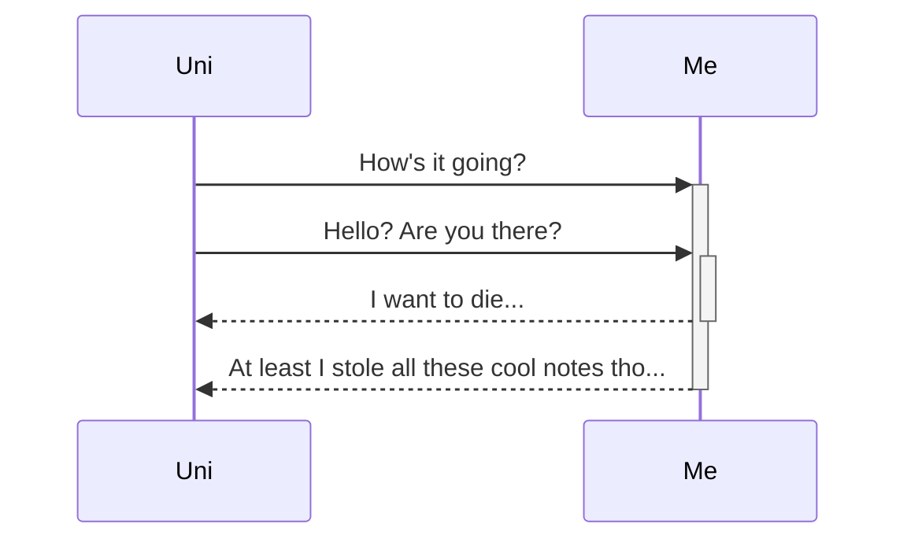
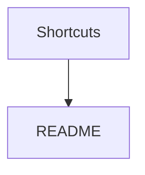
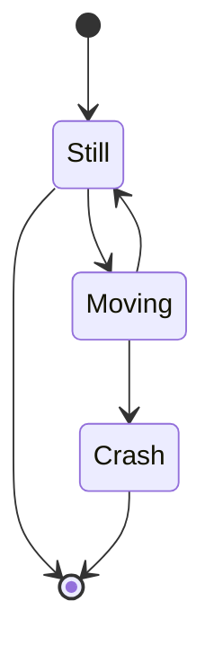

# Obsidian Tips 
---
--- creates a spacer like above
### Hash creates title, more hash = smaller title
[[Stips ✨]]
# Index : 
> [[#Tables]]
> [[#Bullets]]
> [[#Links]]
> [[#Maths]]
> [[#Graphs]]
> [[#Callouts]]
> [[#Data view]]
---

#### Tables

The text below creates the following table   
L-al text | C-al text | R-al text 
:-- | :--: | --: 
I'm **bold** because of \*\*text\*\* | I'm *Italian* because of \*text\* | I'm ==high== because of text \=\=text\=\=

L-al text | C-al text | R-al text 
:-- | :--: | --: 
I'm **bold** because of \*\*text\*\* | I'm *Italian* because of \*text\* | I'm ==high== because of text \=\=text\=\

--- 
#### Bullets 
\- , \1. and - \[  \] used to make : 
- Bullet
1. Numbered
- [ ] Checkbox 

#### Links
links to other files can be made by \[\[ link ]] and links within the files to titles can be done by \[\[# title ]]
[Some text](README)
[[#Index]]

---
#### Maths

in text equations use $ on both sides  $= e^{i\theta\pi}$ 
Block use \$\$ $$ \text{Bonjour, je ne pas da baguette. } \\ f(x) =  \frac{\sum i( 9.81m)}{a} \text{ where } m \text{ is mass }$$
#### Graphs

--- 

## Callouts

> [!note]+
> > [!abstract]-  Abstract, Summary, Tldr
> > Womp womp

> [!info]+ Info, Todo
> > [!success]+ Success, Check, Done
> > susssy $\alpha + \lambda$ $$\begin{aligned} \text{womp womp???} \\ = \sum_{i = 0} ^{i \leq 69} x^2 \\ = 0 + c\end{aligned}$$
> > BOOM and thats how u do it
> 
> > [!failure] Failure, Fail, Missing
> > 

> [!tip] Tip, Hint, Important

> [!question] Question, Help, FAQ

> [!warning]+ Warning, Caution, Attention
> > [!danger] Danger, Error
> 
> > [!bug]

> [!example]+

> [!quote] Quote, Cite

# Data view

| Field Name         | Data Type      | Description                                                                                                                                                                     |
| :----------------- | :------------- | :------------------------------------------------------------------------------------------------------------------------------------------------------------------------------ |
| `file.name`        | Text           | The file name as seen in Obsidians sidebar.                                                                                                                                     |
| `file.folder`      | Text           | The path of the folder this file belongs to.                                                                                                                                    |
| `file.path`        | Text           | The full file path, including the files name.                                                                                                                                   |
| `file.ext`         | Text           | The extension of the file type; generally `md`.                                                                                                                                 |
| `file.link`        | Link           | A link to the file.                                                                                                                                                             |
| `file.size`        | Number         | The size (in bytes) of the file.                                                                                                                                                |
| `file.ctime`       | Date with Time | The date that the file was created.                                                                                                                                             |
| `file.cday`        | Date           | The date that the file was created.                                                                                                                                             |
| `file.mtime`       | Date with Time | The date that the file was last modified.                                                                                                                                       |
| `file.mday`        | Date           | The date that the file was last modified.                                                                                                                                       |
| `file.tags`        | List           | A list of all unique tags in the note. Subtags are broken down by each level, so `#Tag/1/A` will be stored in the list as `[#Tag, #Tag/1, #Tag/1/A]`.                           |
| `file.etags`       | List           | A list of all explicit tags in the note; unlike `file.tags`, does not break subtags down, i.e. `[#Tag/1/A]`                                                                     |
| `file.inlinks`     | List           | A list of all incoming links to this file, meaning all files that contain a link to this file.                                                                                  |
| `file.outlinks`    | List           | A list of all outgoing links from this file, meaning all links the file contains.                                                                                               |
| `file.aliases`     | List           | A list of all aliases for the note as defined via the [YAML frontmatter](https://help.obsidian.md/How+to/Add+aliases+to+note).                                                  |
| `file.tasks`       | List           | A list of all tasks (I.e., `\|[ ] some task`) in this file.                                                                                                                     |
| `file.lists`       | List           | A list of all list elements in the file (including tasks); these elements are effectively tasks and can be rendered in task views.                                              |
| `file.frontmatter` | List           | Contains the raw values of all frontmatter in form of `key \|value` text values; mainly useful for checking raw frontmatter values or for dynamically listing frontmatter keys. |
| `file.day`         | Date           | Only available if the file has a date inside its file name (of form `yyyy-mm-dd` or `yyyymmdd`), or has a `Date` field/inline field.                                            |
| `file.starred`     | Boolean        | if this file has been starred via the Obsidian Core Plugin "Starred Files".                                                                                                     |
