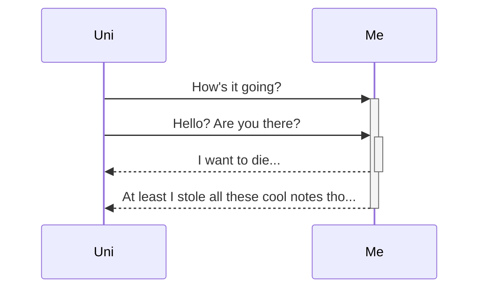
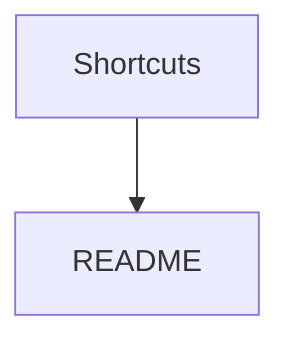
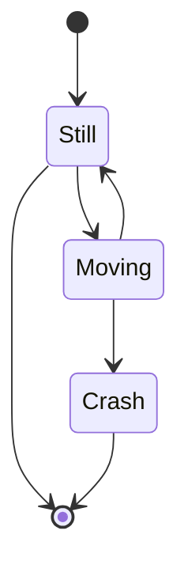

# Obsidian Tips #Structuring
---
--- creates a spacer like above
### Hash creates title, more hash = smaller title

# Index : 
> [[#Tables]]
> [[#Bullets]]
> [[#Links]]
> [[#Maths]]
> [[#Graphs]]
---

#### Tables

The text below creates the following table   
L-al text | C-al text | R-al text 
:-- | :--: | --: 
I'm **bold** because of \*\*text\*\* | I'm *Italian* because of \*text\* | I'm ==high== because of text \=\=text\=\=

L-al text | C-al text | R-al text 
:-- | :--: | --: 
I'm **bold** because of \*\*text\*\* | I'm *Italian* because of \*text\* | I'm ==high== because of text \=\=text\=\

--- 
#### Bullets 
\- , \1. and -[  ] used to make : 
- Bullet
1. Numbered
- [ ] Checkbox 

#### Links
links to other files can be made by \[\[ link ]] and links within the files to titles can be done by \[\[# title ]]
[Some text](README)
[[#Index]]

---
#### Maths

in text equations use $ on both sides  $= e^{i\theta\pi}$ 
Block use \$\$ $$ \text{Bonjour, je ne pas da baguette. } \\ f(x) =  \frac{\sum i( 9.81m)}{a} \text{ where } m \text{ is mass }$$
#### Graphs

